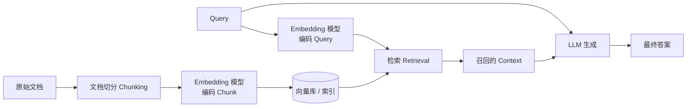
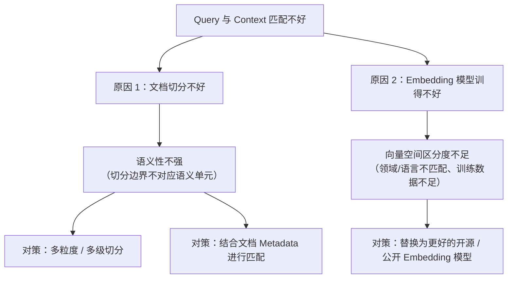

#### [Q19] 什么是 RAG？

RAG（Retrieval-Augmented Generation，检索增强生成）是指：模型在回答问题前，先从外部知识库中检索相关文档，再将问题和检索结果一起输入生成模型，使回答建立在外部证据之上。

一个基本的 RAG 系统包含 Retriever 和 Generator 两部分。对于用户问题 $q$，Retriever 从知识库 $\mathcal D$ 中找出相关文档：

$$
\mathcal D_q
=
\operatorname{TopK}_{d\in\mathcal D}
s(q,d)
$$

然后 Generator 根据问题和检索文档生成答案：

$$
y
\sim
p_\theta(y\mid q,\mathcal D_q)
$$

普通 LLM 主要依赖参数中保存的知识，而 RAG 将知识保存在模型外部。知识库发生变化时，只需更新文档和索引，不需要重新训练模型。因此，RAG 特别适合企业私有知识、时效性信息、专业文档问答和需要引用来源的场景。

RAG 的典型流程是：

$$
\text{用户问题}
\rightarrow
\text{查询改写}
\rightarrow
\text{文档检索}
\rightarrow
\text{重排}
\rightarrow
\text{上下文构造}
\rightarrow
\text{答案生成}
$$

RAG 可以减少因知识缺失或过时产生的幻觉，但不能保证完全消除幻觉。如果检索器没有召回正确文档、文档本身存在错误，或者生成模型没有忠实使用证据，最终回答仍然可能出错。

> [!important]
> RAG 的本质不是让模型永久“学会”检索到的知识，而是在本次推理中将外部文档放入 Context。知识主要保存在外部知识库中，模型参数通常保持不变。

---

#### [Q20] RAG 有哪些代表性技术和工作？

一个典型 RAG 系统可以分为文档处理、检索、重排和生成四个阶段。文档首先经过切分并建立索引；Retriever 找出候选文档；Reranker 对候选结果进行更精细的相关性排序；最后 Generator 根据检索证据回答问题。

| 技术环节 | 代表方法或工作 | 核心作用 |
| --- | --- | --- |
| 稀疏检索 | TF-IDF、BM25 | 根据关键词匹配文档 |
| 稠密检索 | DPR（2020） | 使用双塔 Encoder 在向量空间检索 |
| Late Interaction | ColBERT（2020） | 保留 Token 级交互，兼顾效果与检索效率 |
| 检索增强生成 | RAG（2020） | 将 Dense Retriever 与 Seq2Seq Generator 结合 |
| 检索增强预训练 | REALM（2020）、RETRO（2022） | 在预训练阶段引入外部语料检索 |
| 多文档融合 | FiD（2021） | 分别编码文档，再由 Decoder 融合 |
| 自适应检索 | Self-RAG（2024） | 学习何时检索，并对证据和回答进行反思 |

**DPR（Dense Passage Retrieval）** 使用两个 Encoder 分别编码 Query 和 Passage，并以向量内积作为相关性：

$$
s(q,d)=E_Q(q)^\top E_D(d)
$$

它比纯关键词检索更能处理语义相近但词面不同的问题，但可能遗漏专有名词、编号等精确匹配信息，因此工程中经常将 BM25 与 Dense Retrieval 组合为 Hybrid Search。

**RAG（Retrieval-Augmented Generation，Lewis et al., 2020）** 是“检索增强生成”这一名称的代表性工作。它要解决的问题是：仅依赖参数记忆的 Seq2Seq 模型容易产生事实错误，并且知识更新需要重新训练；而传统开放域问答系统虽然可以检索文档，但生成能力和端到端学习能力有限。RAG 将二者结合：用可学习的 Dense Retriever 提供外部知识，再用生成模型根据问题和检索文档生成答案。

RAG 的模型由两部分组成：

1. **Retriever：** 给定输入问题 $x$，使用 DPR 风格的 Dense Retriever 从 Wikipedia Passage 索引中检索 Top-$K$ 文档 $z$，得到 $p_\eta(z\mid x)$。
2. **Generator：** 使用 BART 这类 Seq2Seq 模型，根据问题 $x$ 和文档 $z$ 生成答案 $y$，得到 $p_\theta(y\mid x,z)$。

因此，RAG 的生成概率可以看成对检索文档这个隐变量 $z$ 做边缘化：

$$
p(y\mid x)
=
\sum_{z\in \operatorname{TopK}(x)}
p_\eta(z\mid x)\,
p_\theta(y\mid x,z)
$$

直观理解是：模型不是只根据问题直接生成答案，而是先检索若干可能有用的证据文档，再综合“这篇文档被检索到的概率”和“基于这篇文档生成答案的概率”来预测最终答案。

RAG 论文提出了两个主要变体：

| 变体 | 核心区别 | 适用直觉 |
| --- | --- | --- |
| RAG-Sequence | 整个输出序列共享同一批检索文档 | 适合答案主要依赖单个或少数稳定证据的任务 |
| RAG-Token | 每个生成 Token 都可以重新边缘化检索文档 | 更灵活，但计算更复杂 |

训练时，RAG 通常只需要输入 $x$ 和目标答案 $y$，不要求人工标注“应该检索哪篇文档”。Retriever 和 Generator 可以通过答案生成的边际似然联合优化，使 Retriever 学会把有助于生成正确答案的文档排在前面。这一点使 RAG 比“先检索、再固定拼接上下文”的流水线方法更接近端到端系统。

RAG 的优势主要有三点：

- **知识可更新：** 外部知识存放在文档索引中，更新知识库通常比重新训练模型便宜。
- **事实性更强：** 生成过程有检索证据支撑，开放域问答和知识密集型任务上通常优于纯参数模型。
- **可解释性更好：** 检索出的 Passage 可以作为答案依据，便于检查模型使用了哪些外部信息。

但 RAG 也有明显限制：

- 如果 Retriever 没有召回正确文档，Generator 很难凭空修正错误；
- 如果检索文档相关但不充分，模型可能把多个片段错误拼接，产生不忠实回答；
- 原始 RAG 对多文档信息融合仍然较粗糙，因为每篇文档通常独立影响生成概率，复杂问题上的跨文档推理能力有限。

> [!important]
> RAG 的关键思想是把“知识存储”从模型参数中部分外移到可检索文档库中。模型参数主要负责理解问题、匹配证据和组织答案；事实知识则更多由外部语料提供。

**FiD（Fusion-in-Decoder）** 是在 RAG 之后常被对比的多文档融合方法。它分别编码多篇检索文档，再让 Decoder 统一融合，提升了多文档问答能力。

**REALM** 和 **RETRO** 将检索进一步放入预训练阶段，使模型从训练开始就学习如何利用外部文本。**Self-RAG** 则引入特殊的 Reflection Token，让模型判断是否需要检索、文档是否相关以及回答是否得到证据支持。

> [!note]
> RAG 的效果上限通常首先由检索质量决定。生成模型再强，如果检索阶段没有召回正确证据，也很难生成可靠答案。因此实际系统需要分别评估 Recall@K、重排质量、答案正确性、引用忠实度和端到端延迟。

#### [Q1] RAG 核心组件、RAG 系统中最关键的组件有哪些？整体架构是什么样的？

RAG（Retrieval-Augmented Generation）系统中，最关键的三个组件是：

1. **Embedding 模型**：把文档片段（chunk）和 Query 都编码成向量，决定语义相似度计算的准确性，是检索质量的基础。
2. **文档切分（Chunking）方法**：决定 Context 以什么粒度被切开、被检索到，切分质量直接影响"检索到的内容是否真的对 Query 有用"。
3. **LLM（生成模型）**：基于检索回来的 Context 生成最终答案，决定模型能否正确利用、整合检索到的信息，而不是被无关或冲突的 Context 干扰。

三者的关系可以理解为一条流水线，前两者共同决定"召回什么"，后者决定"怎么用召回的内容回答"：

> [!note] 三个组件分别对应的失败模式
> - Embedding 模型不好 → 语义相近的 Query 和 Chunk 在向量空间里离得不够近，召回不到真正相关的内容；
> - 切分方法不好 → 即使 Embedding 模型足够强，被切碎或切得不合理的 Chunk 本身语义不完整，也很难和 Query 匹配上；
> - LLM 不好 → 即使召回的 Context 是对的，模型也可能不会正确引用、整合，或被 Context 中的噪声干扰（如长 Context 中的"lost in the middle"问题）。

---

#### [Q2] 如果 Query 和 Context 匹配不好，可能有哪些原因？有哪些对策？

Query 检索不到合适 Context，最常见的两类原因分别出在**切分阶段** 和**Embedding 模型阶段**：

##### [Q2.1] 文档切分不好具体指什么？有哪些应对方式？

**问题表现**：文档切分时** 语义性不强**——切分边界是按固定字符数/段落机械切开的，而不是按语义单元切开，导致：

- 一个 Chunk 内混入了多个不相关的语义片段，向量表示被"稀释"，和 Query 的相似度计算不准；
- 某个语义完整的回答所需信息被切分点拆成两半，分别落在前后两个 Chunk 里，单独检索任何一个 Chunk 都不足以匹配 Query。

**对策**：

1. **多粒度、多级切分（Multi-granularity / Hierarchical Chunking）**：不只用一种固定大小切分文档，而是同时维护多个层级的切分结果（如：段落级、句子级、章节级），检索时可以按需匹配不同粒度——Query 较具体时匹配细粒度 Chunk，Query 较宽泛时匹配粗粒度 Chunk，缓解"切分粒度固定、不能适应 Query 颗粒度"的问题。
2. **结合文档 Metadata 进行匹配**：除了 Chunk 本身的文本向量，还利用文档的结构化信息（如标题、章节路径、来源、时间、标签等）辅助匹配——既可以把 Metadata 拼接进 Embedding 输入帮助模型理解上下文，也可以作为检索阶段的过滤/重排条件（先按 Metadata 缩小候选范围，再做向量相似度匹配），弥补单纯依赖切分文本语义性不足的问题。

##### [Q2.2] Embedding 模型训得不好具体指什么？有哪些应对方式？

**问题表现**：Embedding 模型本身的训练质量不够——可能是训练数据覆盖的领域、语言风格与实际场景不匹配，或者模型规模/训练方法本身较弱，导致语义相近的 Query 和 Context 在向量空间中没有被拉得足够近，检索阶段排序靠前的结果并不是真正相关的内容。

**对策**：

- **更换为开源、公开的更好的 Embedding 模型**：优先选用在公开榜单（如 MTEB）上检索任务表现更好、且训练数据和目标场景语言/领域更接近的开源 Embedding 模型，而不是自行训练或沿用一个未经充分验证的模型。

> [!tip] 两类对策的本质区别
> 切分方法的对策（多粒度切分、结合 Metadata）改变的是"喂给 Embedding 模型的输入单元"；更换 Embedding 模型的对策改变的是"把输入单元映射到向量空间的能力"。两者互相独立，实践中通常一起排查：先确认 Chunk 本身语义是否完整、是否需要 Metadata 辅助，再确认当前 Embedding 模型在目标领域/语言上的检索效果是否已经是公开可得的较优选择。

---

#### [Q3] RAG 主要解决 LLM 的哪些问题？

RAG 主要解决 LLM 的三类问题：**幻觉、（训练）效率、数据安全** 。

1. **幻觉（Hallucination）**：LLM 仅依赖参数中编码的知识回答问题时，遇到训练数据未覆盖、已过时或本身记错的内容，容易生成看似合理但事实错误的回答。RAG 在生成前先检索出与 Query 相关的真实文档片段作为 Context，让模型基于外部证据回答，而不是单纯依赖参数记忆，从而降低无依据编造内容的概率。
2. **效率（训练效率）**：这里指的是** 训练效率**，而不是推理效率——如果要让模型掌握新知识或频繁更新的知识（如最新政策、产品文档、内部资料），传统做法是持续预训练或微调，成本高、周期长，且每次知识更新都要重新训练。RAG 把"知识"放在外部可检索的知识库里，知识更新只需要更新向量库/文档库，不需要重新训练或微调模型本身，大幅降低了让模型"学会新知识"的训练成本。
3. **数据安全（Data Security）**：企业内部数据（如内部文档、客户资料、专有知识）通常不适合直接拿去训练或微调模型——一旦数据被编码进模型参数，很难保证后续不会被该模型以某种形式泄露出去，且训练过程本身也涉及数据出域的风险。RAG 让敏感数据始终留在受控的外部知识库中，模型推理时按权限检索、按需读取，不需要把这些数据写入模型参数，更符合数据隔离和权限管控的要求。

> [!note] 三类问题的共同点
> 三者本质上都是在解决同一个根本问题：**"知识"和"模型参数"过度绑定带来的代价**——绑定导致知识可能是错的/过时的（幻觉）、更新知识代价高（训练效率）、敏感知识无法安全隔离（数据安全）。RAG 把知识从参数中"解耦"出来，放进外部可检索、可更新、可权限控制的知识库，模型只负责基于检索结果做理解和生成。

---

#### [Q4] 查询重写（Query Rewriting）指的是什么？有哪些常见做法？

查询重写（Query Rewriting）指在检索之前，先对用户原始 Query 做一次或多次转换，使其更容易匹配到向量库中真正相关的 Context，而不是直接拿用户的原始输入做检索。常见做法包括：

1. **改写为更详细、更贴合 Embedding 训练分布的 Query**：用户的原始提问往往简短、口语化，与训练 Embedding 模型时所用的 Query 格式（如更完整的陈述句、更规范的术语表达）不一致，导致向量空间中的相似度计算不准。这种做法是把原始 Query 改写得更详细、更规范，使其更接近 Embedding 模型训练时见过的 Query 分布，从而提升检索匹配效果。
2. **查询拆分（Query Decomposition）**：基于大模型自己的理解，把一个复杂或包含多个子问题的 Query 拆分成多个更聚焦的子 Query，分别检索后再汇总结果。适合处理"一个问题里其实问了好几件事"的情况，避免单次检索因 Query 过于宽泛而召回不到所有需要的信息。
3. **假设性文档/答案匹配（如 HyDE）**：让模型先基于自己的理解生成一版"伪答案"（假设性回答），再用这个伪答案（而不是原始 Query）去和向量库中的 Context 做相似度匹配。其原理是：答案与答案之间的语义相似度，往往比"问题"和"答案"之间的语义相似度更容易被 Embedding 模型捕捉到，因此用伪答案去检索可以提升召回的准确性。

> [!tip] 三种做法的角度区分
> 第一种是在"Query 表达方式"层面做改写，让 Query 更像 Embedding 模型熟悉的输入；第二种是在"Query 粒度"层面做拆分，让每次检索的目标更聚焦；第三种是在"检索的对象"层面做转换，不直接用 Query 检索，而是用模型生成的伪答案去检索，缩小 Query 和 Context 之间的语义差距（query-document gap）。三者可以组合使用，例如先拆分出子 Query，再对每个子 Query 分别做伪答案生成后检索。

---
